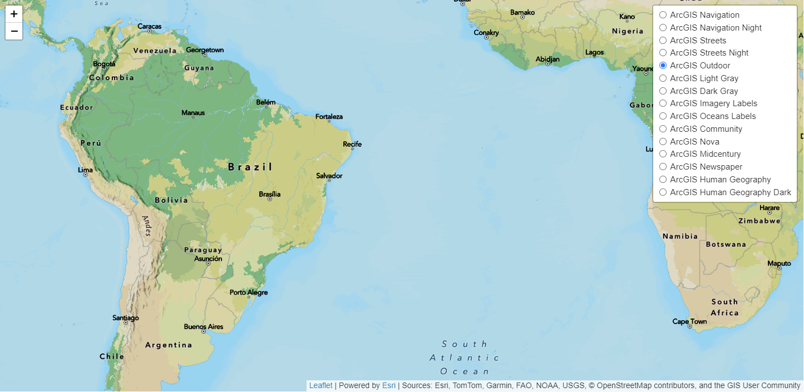

# Esri Leaflet Static Basemap Tile Plugin

...

> A plugin for Esri Leaflet to visualize static basemap tiles 
from the static basemap tile service.

The Esri Leaflet Static Basemap Tile package provides a class to load static basemap tiles from the [ArcGIS static basemap tile service](https://developers.arcgis.com/rest/basemap-styles/). Basemaps are rendered as image tiles that adhere to the [OpenAPI specification](https://static-map-tiles-api.arcgis.com/arcgis/rest/services/static-basemap-tiles-service/beta/specification/open-api-v3-0/).

## Example

Check out the [live demo]().



```html
<!DOCTYPE html>
<html>
  <head>
    <meta charset="utf-8" />
    <title>Esri Leaflet Static Basemap Tiles</title>
    <meta name="viewport" content="width=device-width, initial-scale=1" />

    <!-- Load Leaflet from CDN -->
    <link rel="stylesheet" href="https://unpkg.com/leaflet/dist/leaflet.css" />
    <script src="https://unpkg.com/leaflet/dist/leaflet.js"></script>

    <!-- Load Esri Leaflet -->
    <script src="https://unpkg.com/esri-leaflet/dist/esri-leaflet.js"></script>

    <!--  Load Esri Leaflet Static Basemap Tile -->
    <script src="https://unpkg.com/esri-leaflet-static-basemap-tile/dist/esri-leaflet-static-basemap-tile.js"></script>
    
    <style>
      body {
        margin: 0;
        padding: 0;
      }

      #map {
        position: absolute;
        top: 0;
        bottom: 0;
        right: 0;
        left: 0;
      }
    </style>
  </head>

  <body>
    <div id="map"></div>

    <script>
      var map = L.map("map").setView([40.706, -73.926], 4);

      L.esri.Static.staticBasemapTileLayer("beta/arcgis/outdoor", {
        token: "< YOUR ARCGIS ACCESS TOKEN HERE >"
      }).addTo(map);
    </script>
  </body>

</html>
```

## API Reference

### [`L.esri.Static.staticBasemapTileLayer`]()

`L.esri.Static.staticBasemapTileLayer(<String> style, <Object> options)`

Displays a basemap layer using tiles from the ArcGIS [Static basemap tiles service](https://developers.arcgis.com/rest/static-basemap-tiles/) (currently in beta). Extends [L.TileLayer](https://leafletjs.com/reference.html#tilelayer).

```js
L.esri.Static.staticBasemapTileLayer("beta/arcgis/streets", {
  token: "< YOUR ARCGIS ACCESS TOKEN HERE >"
}).addTo(map);
```

```js
L.esri.Static.staticBasemapTileLayer("beta/arcgis/newspaper", {
  token: "< YOUR ARCGIS ACCESS TOKEN HERE >",
  language: "fr"
}).addTo(map);
```

* The `style` parameter must be a valid [basemap style code](#basemap-styles).

* The `token` parameter must be a valid [ArcGIS access token](https://developers.arcgis.com/documentation/security-and-authentication/api-key-authentication/tutorials/create-an-api-key/).

For a full list of parameters, go to the Esri Leaflet [API reference]().

#### Basemap Styles

`staticBasemapTileLayer` accepts a basemap style code as a string in the format `beta/<provider>/<style>`. For example, `beta/arcgis/outdoor` will load the [ArcGIS Outdoor](https://developers.arcgis.com/rest/static-basemap-tiles/arcgis-outdoor-tile-get/) basemap style.

For a full list of supported basemap styles, go to the [static basemap tiles service documentation](https://developers.arcgis.com/rest/static-basemap-tiles/).

### [`L.esri.Static.Util`]()

`L.esri.Static.Util.getSelf(<String> token)`

Utility method that makes a request to the [`/self`](https://developers.arcgis.com/rest/static-basemap-tiles/service-self-get/) endpoint of the ArcGIS static basemap tiles service. Requires a valid [ArcGIS access token](https://developers.arcgis.com/documentation/security-and-authentication/api-key-authentication/tutorials/create-an-api-key/).

This endpoint returns a list of all supported basemap styles and language parameters, which can be useful in creating maps that support multiple styles or languages.

## Development Instructions

### Quickstart Development Instructions

1. [Fork and clone this repo](https://help.github.com/articles/fork-a-repo).
2. `cd` into the `esri-leaflet-static-basemap-tile` folder.
3. Install the dependencies with `npm install`.
4. Run `npm run dev` to compile the raw source inside a newly created `dist` folder and start up a development web server.
   - Alternatively, run `npm run start` to compile raw source code into both "debug" and "production" versions. This process will take longer to compile when saving your local changes to source code. Recommended only when building for production.
5. Open `examples/quickstart-dev.html` to see local changes in action.

### Advanced Development Instructions

1. [Fork and clone this repo](https://help.github.com/articles/fork-a-repo).
2. `cd` into the `esri-leaflet-static-basemap-tile` folder.
3. Install the dependencies with `npm install`.
4. Run `npm run build` to compile the raw source inside a newly created `dist` folder.
5. Run `npm test` from the command line to execute tests.
6. Open `examples/quickstart-dev.html` or `examples/quickstart-prod.html` to see local changes in action.
7. Create a [pull request](https://help.github.com/articles/creating-a-pull-request) if you'd like to share your work.

## Dependencies

- Leaflet version [1.5.0](https://github.com/Leaflet/Leaflet/releases/tag/v1.5.0) (or higher) is required.
- Esri Leaflet [2.3.0](https://github.com/Esri/esri-leaflet/releases/tag/v2.3.0) (or higher) is required.

## Resources

- [ArcGIS for Developers](http://developers.arcgis.com)
- [ArcGIS REST Services](http://resources.arcgis.com/en/help/arcgis-rest-api/)
- [@Esri](http://twitter.com/esri)

## Issues

Find a bug or want to request a new feature? Please let us know by submitting an [issue](https://github.com/Esri/esri-leaflet-static-basemap-tile/issues).

Please take a look at previous issues on [Esri Leaflet](https://github.com/Esri/esri-leaflet/issues?labels=FAQ&milestone=&page=1&state=closed) that resolve common problems.

You can also post questions on the [GIS Stack Exchange](http://gis.stackexchange.com/questions/ask?tags=esri-leaflet,leaflet), as well as the [Open Source Mapping community](https://community.esri.com/t5/open-source-mapping-libraries-ques/bd-p/open-source-mapping-libraries-questions) on Esri forums.

## Contributing

Esri welcomes contributions from anyone and everyone. Please see our [guidelines for contributing](https://github.com/Esri/esri-leaflet/blob/master/CONTRIBUTING.md).

## [Terms](https://github.com/Esri/esri-leaflet#terms)

## Licensing

Copyright &copy; 2016-2024 Esri

Licensed under the Apache License, Version 2.0 (the "License");
you may not use this file except in compliance with the License.
You may obtain a copy of the License at

> http://www.apache.org/licenses/LICENSE-2.0

Unless required by applicable law or agreed to in writing, software
distributed under the License is distributed on an "AS IS" BASIS,
WITHOUT WARRANTIES OR CONDITIONS OF ANY KIND, either express or implied.
See the License for the specific language governing permissions and
limitations under the License.

A copy of the license is available in the repository's [LICENSE](./LICENSE) file.
